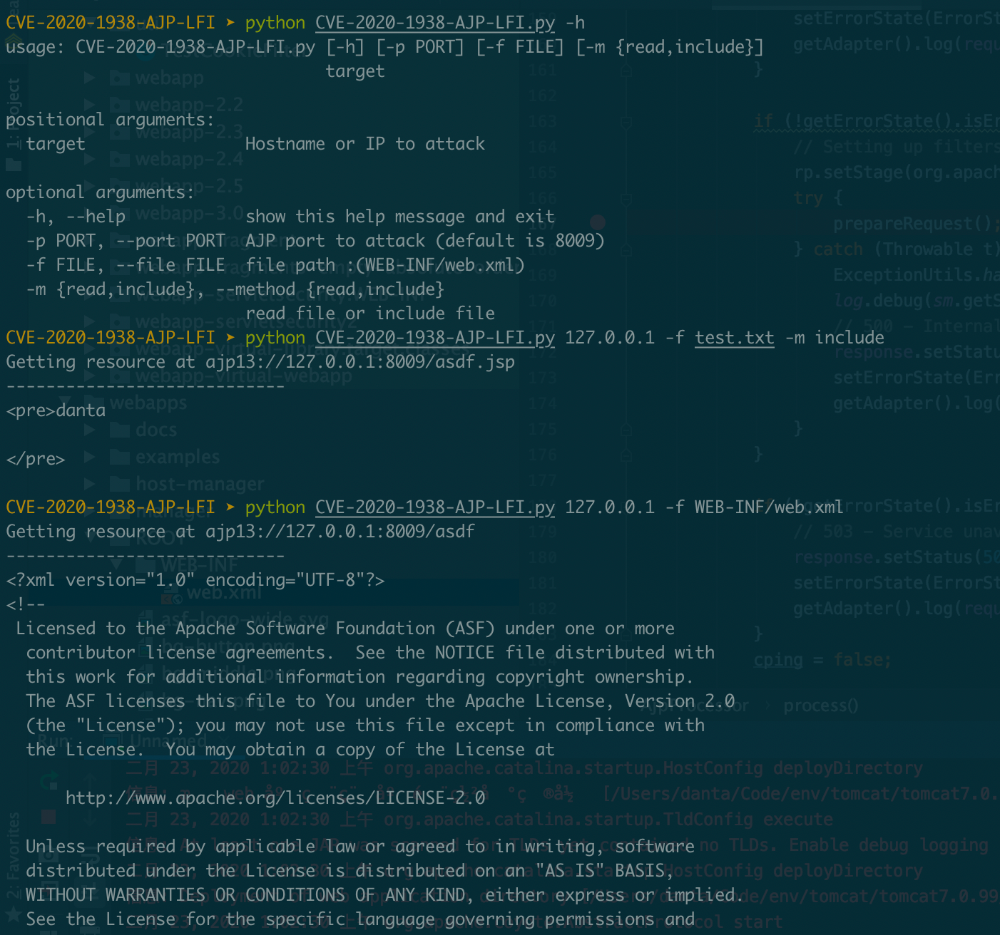

# 0x0 Tomcat环境搭建

在官网中下载Tomcat 源码以及core版本：https://archive.apache.org/dist/tomcat/

按照博文https://www.jianshu.com/p/4349f4b16eca 进行调试tomcat代码

# 0x1 漏洞分析

tomcat在接收ajp请求的时候调用org.apache.coyote.ajp.AjpProcessor来处理ajp消息，该类里面会调用prepareRequest方法将ajp里面的内容取出来设置成request对象的Attribute属性。接着会根据请求调用不同的Servlet来处理。

Line 167: prepareRequest() ：将ajp里面的内容（此内容可控）取出来设置成request对象的Attribute属性

Line 190: 根据请求调用不同的Servlet来处理，此处规则在conf/web.xml中可见。

  default -> org.apache.catalina.servlets.DefaultServlet    

  jsp -> org.apache.jasper.servlet.JspServlet

若进入default逻辑，由于request可控，则文件路径可控，可触发文件读取漏洞：

若进入JSP逻辑，可触发文件包含漏洞：

# 0x2 验证

本文的POC是基于 https://github.com/YDHCUI/CNVD-2020-10487-Tomcat-Ajp-lfi 修改的，增加了文件包含的漏洞利用。

# 0x3 参考

[0] https://mp.weixin.qq.com/s/GzqLkwlIQi_i3AVIXn59FQ

[1] https://mp.weixin.qq.com/s/v3EQw4xaE4QTbvEwkfHz9w

[2] https://github.com/YDHCUI/CNVD-2020-10487-Tomcat-Ajp-lfi

